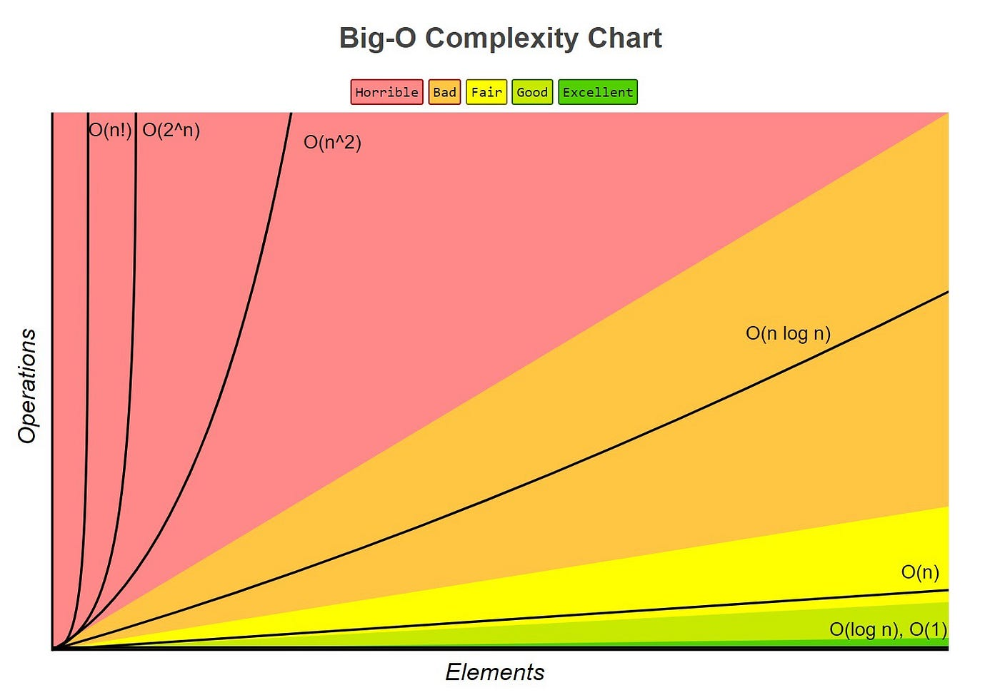

# Big-O, Estruturas de Dados e Algoritmos

Repositório dedicado ao estudo de Big-O, algoritmos e estruturas de dados, com exemplos práticos e análises de complexidade.

---

## Big-O

A Notação Big-O (O) é a principal métrica para descrever a complexidade (desempenho) de um algoritmo em função do tamanho da entrada (n). Ela mede como o tempo de execução ou o espaço de memória requerido pelo algoritmo cresce à medida que o tamanho da entrada aumenta, focando no pior caso.

---

| Notação Big-O | Nome               | Descrição                                                                         | Exemplo Comum                               |
| ------------- | ------------------ | --------------------------------------------------------------------------------- | ------------------------------------------- |
| O(1)          | Tempo Constante    | O tempo de execução não muda com o tamanho da entrada.                            | Acessar um elemento por índice em um array. |
| O(log n)      | Tempo Logarítmico  | O tempo de execução se reduz pela metade a cada passo. Muito rápido.              | Busca Binária (Binary Search).              |
| O(n)          | Tempo Linear       | O tempo de execução cresce proporcionalmente ao tamanho da entrada.               | Iterar uma lista/array uma vez.             |
| O(n log n)    | Tempo Linearítmico | Comum em algoritmos de ordenação eficientes.                                      | Merge Sort, Heap Sort.                      |
| O(n²)         | Tempo Quadrático   | O tempo cresce com o quadrado do tamanho da entrada. Normalmente loops aninhados. | Bubble Sort, comparar pares em um array.    |
| O(2ⁿ)         | Tempo Exponencial  | O tempo dobra a cada nova unidade da entrada. Muito lento.                        | Fibonacci com recursão ingênua.             |
| O(n!)         | Tempo Fatorial     | Crescimento absurdo (permutações). Inviável para entradas maiores que 10–20.      | Traveling Salesman por força bruta.         |

---

## Complexidade - O(1) Tempo Constante

A complexidade de tempo O(1) (Tempo Constante) é a mais eficiente em termos de Big-O. Ela significa que o tempo de execução de um algoritmo ou de uma operação não muda em relação ao tamanho da entrada (n).Independentemente se você está trabalhando com 1 item, 1.000 itens ou 1 bilhão de itens, a operação levará essencialmente o mesmo tempo.

### Exemplo Clássico:

1. **Acessar um elemento de um Array pelo índice**

   - Se você tem uma lista e sabe exatamente a posição (o índice) do que precisa, o computador chega lá instantaneamente. Ele não precisa ler os itens anteriores; ele faz um cálculo matemático simples de endereço de memória.

#### Exemplos de Uso:

> [Ruby O(1)](algoritmos/ruby_algoritmos/tempo_constante.rb)

> [Javascript O(1)](algoritmos/javascript_algoritmos/tempo_constante.js)

---

## Complexidade - O(log n) Tempo Logarítmico

O **Tempo Logarítmico**, representado como **O(log n)**, descreve um algoritmo cuja eficiência de execução (o tempo que ele leva) cresce de forma muito lenta conforme o tamanho da entrada (n) aumenta. É muito mais rápido do que o tempo linear O(n).

A chave do tempo logarítmico é o conceito de dividir para conquistar. Em cada passo ou iteração, o algoritmo consegue descartar uma grande porção dos dados de entrada, geralmente metade deles. Isso significa que, para dobrar o tamanho da entrada, você só precisa de uma operação extra para processar os dados.

#### Exemplo Clássico:

O exemplo mais comum de um algoritmo com complexidade O(log n) é a **Busca Binária** (Binary Search).

1. **Pré-requisito:**  A Busca Binária só funciona em listas ou arrays que já estão ordenados.

2. **Mecanismo:**  Para encontrar um item em uma lista ordenada, o algoritmo não verifica elemento por elemento (isso seria O(n)). Em vez disso, ele:

   - **Verifica o elemento do meio** da lista.
  
   - Compara o valor do meio com o valor que está procurando.
  
   - Se o valor do meio for menor, ele sabe que o item desejado deve estar na **metade superior** da lista e **descarta toda a metade inferior.**

3. **Resultado:**  Em cada passo, o espaço de busca é **reduzido pela metade.** É por isso que a eficiência é logarítmica (na base 2, log_2 n).

#### Exemplos de Uso:

> [Ruby O(log n)](algoritmos/ruby_algoritmos/tempo_logaritmico.rb)

> [Javascript O(log n)](algoritmos/javascript_algoritmos/tempo_logaritmico.js)

---

## Complexidade - O(n) Tempo Linear

O **Tempo Linear**, ou **O(n)**, descreve algoritmos cujo tempo de execução cresce de forma **diretamente proporcional** ao **tamanho da entrada** (n).

**Proporcionalidade Direta:** Se a entrada tem 10 elementos e o algoritmo leva 10 milissegundos, para 20 elementos ele levará aproximadamente 20 milissegundos. Se a entrada dobra, o tempo dobra.

 #### Exemplos Típicos de O(n):
 
Um algoritmo é linear quando ele precisa, no pior caso, tocar ou processar cada elemento da entrada uma única vez.

1. **Busca Linear (ou Busca Sequencial)**

   - **Problema:** Encontrar um valor específico em uma lista de n elementos.

   - **Processo:** Você percorre a lista do começo ao fim.

   - **Pior Caso:** O valor procurado é o último elemento da lista ou não existe. O algoritmo deve verificar todos os n elementos antes de concluir.
  
2. **Encontrar o Valor Mínimo/Máximo**

   - **Problema:** Encontrar o maior ou menor número em uma lista desordenada de n elementos.
  
   - **Processo:** Você precisa iterar sobre a lista inteira, comparando cada elemento com o valor máximo/mínimo atual.

   - **Complexidade:** Você faz exatamente n-1 comparações, o que é arredondado para O(n).

3. **Cópia de um Array Problema:**

   - **Problema:** Criar uma cópia exata de um array (vetor) de n elementos.
  
   - **Processo:** Você deve acessar cada um dos n elementos do array original para copiá-lo para o novo array.

#### Exemplos de Uso:

> [Ruby O(n)](algoritmos/ruby_algoritmos/tempo_linear.rb)

> [Javascript O(n)](algoritmos/javascript_algoritmos/tempo_linear.js)

---

## Complexidade - O(n log n)  Tempo Linearítmico

O tempo de execução Linearítmico, expresso como O(n log n), é uma complexidade de tempo comum e muito eficiente em algoritmos de ordenação de dividir para conquistar.Ele representa uma taxa de crescimento que é um pouco mais lenta que a linear (O(n)), mas significativamente mais rápida que a quadrática (O(n^2)) ou exponencial.

**O que significa O(n log n)?**

Para entender essa complexidade, imagine que ela é a combinação de duas forças:

1. **n (Linear):**  Você precisa passar por quase todos os elementos da lista.

2. **log n (Logarítmica):**  Em cada passo ou nível, você divide o problema pela metade (estratégia de "Dividir para Conquistar").

Quando multiplicamos as duas, temos um algoritmo que processa os dados de forma muito mais inteligente do que comparar "todo mundo com todo mundo" (n * n).

**Comparação de Crescimento:**

Se tivermos **1.000.000** de itens:

   - **O(n):** 1.000.000 de operações.
  
   - **O(n log n):** Aproximadamente 20.000.000 de operações (muito viável).

   - **O(n^2):** 1.000.000.000.000 de operações (extremamente lento).

#### Exemplos Clássicos:

A maioria dos algoritmos eficientes de ordenação utiliza essa complexidade:

**1 . Merge Sort (Ordenação por Intercalação)**

O Merge Sort divide a lista repetidamente ao meio até que restem apenas listas de um único elemento. Depois, ele as combina de volta em ordem.

   - **Divisão:** log n níveis de divisões.
  
   - **Combinação:** n operações para comparar e juntar os elementos em cada nível.
  
   - **Total:** O(n log n).
  
**2 . Quick Sort**
  
  No caso médio, o Quick Sort escolhe um "pivô" e particiona a lista. Se o pivô for bem escolhido, ele segue o padrão linearítmico.
  
  **Nota**: Em seu pior cenário (lista já ordenada e pivô ruim), ele pode cair para O(n^2), mas na prática é um dos mais rápidos.

  #### Exemplos de Uso:

> [Ruby O(n log n)](algoritmos/ruby_algoritmos/tempo_linearítmico.rb)

> [Javascript O(n log n)](algoritmos/javascript_algoritmos/tempo_linearítmico.js)

---

## Complexidade - O(n²) Tempo Quadrático

O tempo de execução Quadrático, expresso como **O(n²)**, é uma complexidade de tempo comum em algoritmos de ordenação simples e algoritmos de força bruta. Ele representa uma taxa de crescimento em que o tempo necessário para executar o algoritmo cresce de forma proporcional ao quadrado do tamanho da entrada ($n$). Para pequenas quantidades de dados ele é viável, mas se torna rapidamente ineficiente à medida que o volume de dados aumenta.

**O que significa O(n²)?**

Para entender essa complexidade, imagine que ela é a combinação de duas operações encadeadas:

1. **Laço Externo ($n$):** Você precisa iterar sobre todos os elementos da lista.

2. **Laço Interno ($n$):** Para cada elemento do laço externo, você precisa percorrer a lista inteira novamente.

Quando multiplicamos as duas ($n \times n$), temos um algoritmo que compara "todo mundo com todo mundo". Se você dobrar o tamanho da lista, a quantidade de processamento não dobra — ela quadruplica ($2^2 = 4$).

**Comparação de Crescimento:**

Se tivermos **10.000** itens:

   - **O(n):** 10.000 de operações (instantâneo).

   - **O(n log n):** Aproximadamente 130.000 de operações (muito rápido).

   - **O(n²):** 100.000.000 de operações (começa a engasgar o sistema).

Se tivermos **1.000.000** de itens:

   - **O(n²):** 1.000.000.000.000 de operações (1 trilhão de operações — impraticável).

#### Exemplos Clássicos:

A maioria dos algoritmos simples de ordenação e operações com laços aninhados utiliza essa complexidade:

**1 . Bubble Sort (Ordenação por Bolha)**

O Bubble Sort percorre a lista repetidamente, comparando elementos adjacentes e os trocando de lugar se estiverem na ordem errada.

   - **Laço Externo:** Executa "n" vezes para garantir que todos os elementos fiquem ordenados.

   - **Laço Interno:** Faz "n" comparações a cada passagem para mover o maior elemento.

   - **Total:** O(n²).

**2 . Insertion Sort (Ordenação por Inserção)**

O Insertion Sort constrói a lista ordenada um item por vez, inserindo cada novo elemento na posição correta entre os já ordenados.

   - **Pior Caso:** Se a lista estiver invertida, cada novo elemento precisará ser comparado com todos os elementos anteriores.

   - **Total:** O(n²).

**3 . Laços Aninhados (Nested Loops)**

Percorrer uma matriz $n \times n$ ou encontrar todos os pares possíveis dentro de um conjunto de dados.

 #### Exemplos de Uso:

> [Ruby O(n²)](algoritmos/ruby_algoritmos/tempo_quadratico.rb)

> [javascript O(n²)](algoritmos/javascript_algoritmos/tempo_quadratico.js)

---

## Complexidade - O(2ⁿ) Tempo Exponencial

O tempo de execução Exponencial, expresso como **O(2ⁿ)**, é uma das piores e mais custosas complexidades de tempo na ciência da computação. Ele representa uma taxa de crescimento em que o tempo necessário para executar o algoritmo **dobra a cada novo elemento** adicionado à entrada ($n$). Algoritmos com essa complexidade tornam-se inviáveis mesmo para entradas muito pequenas.

**O que significa O(2ⁿ)?**

Para entender essa complexidade, imagine que ela funciona como uma reação em cadeia ou uma árvore de decisões:

1. **Decisão Dupla:** A cada novo elemento do problema, o número de caminhos ou subproblemas a resolver multiplica por 2.

2. **Crescimento Explosivo:** Para $n = 1$, temos $2$ operações; para $n = 2$, temos $4$; para $n = 3$, temos $8$; para $n = 10$, temos $1.024$ operações.

Diferente do crescimento polinomial ($n^2$), onde a base é a entrada e o expoente é fixo, no crescimento exponencial **a própria entrada fica no expoente**.

**Comparação de Crescimento:**

Imagine adicionar apenas **10 itens** a mais em uma entrada:

* **Para $n = 10$:**
  * **O(n):** 10 operações.
  * **O(n²):** 100 operações.
  * **O(2ⁿ):** 1.024 operações.

* **Para $n = 30$:**
  * **O(n):** 30 operações.
  * **O(n²):** 900 operações.
  * **O(2ⁿ):** 1.073.741.824 operações (mais de 1 bilhão).

* **Para $n = 100$:**
  * **O(2ⁿ):** Aproximadamente $1,26 \times 10^{30}$ operações — uma quantidade imensamente maior do que o número total de átomos na Terra, tornando a execução **impossível**, mesmo com supercomputadores.

#### Exemplos Clássicos:

Algoritmos que tentam explorar **todas as combinações ou subconjuntos possíveis** de um conjunto costumam ter complexidade exponencial:

**1 . Fibonacci Ineficiente (Recursão Simples)**

Calcular o $n$-ésimo termo da sequência de Fibonacci chamando a função recursivamente sem memorização (*memoization*).

* **Estrutura:** Cada chamada gera 2 novas chamadas de função em uma árvore que cresce em profundidade até $n$.
* **Total:** $O(2^n)$ chamadas de função (muitos cálculos são repetidos desnecessariamente).

**2 . Problema dos Subconjuntos (Power Set)**

Gerar todos os subconjuntos possíveis de um conjunto com $n$ elementos.

* **Lógica:** Para cada elemento do conjunto, você tem 2 escolhas: **incluí-lo** ou **não incluí-lo** no subconjunto.
* **Total:** Um conjunto de $n$ elementos tem exatamente $2^n$ subconjuntos possíveis.

**3 . Força Bruta para Senhas / Combinações**

Testar todas as combinações de chaves binárias de tamanho $n$ (onde cada bit pode ser `0` ou `1`).

 #### Exemplos de Uso:

> [Ruby O(n²)](algoritmos/ruby_algoritmos/tempo_exponencial.rb)

> [javascript O(n²)](algoritmos/javascript_algoritmos/tempo_exponencial.js)

---